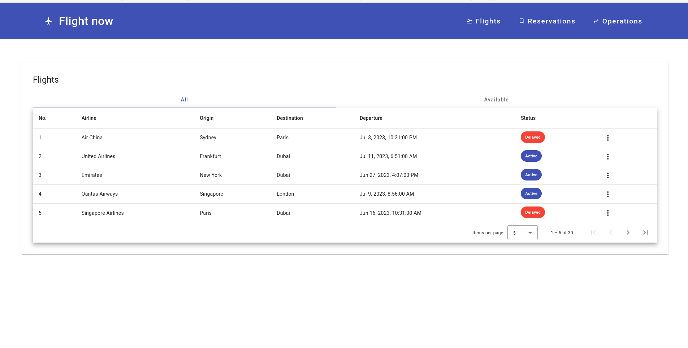
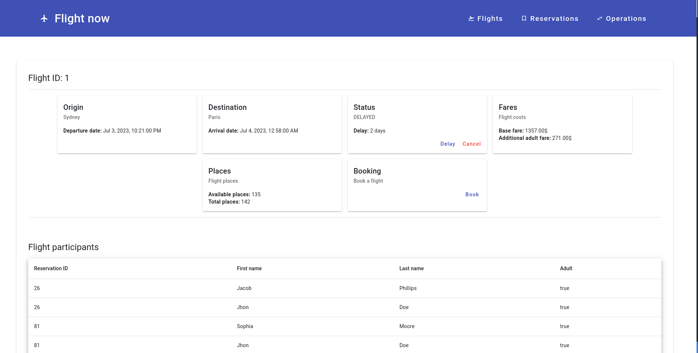
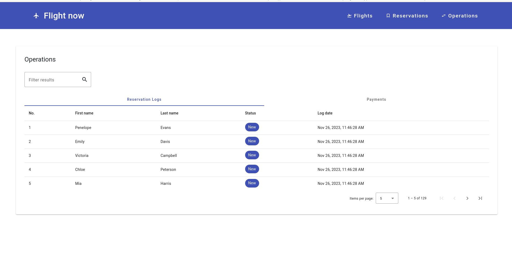
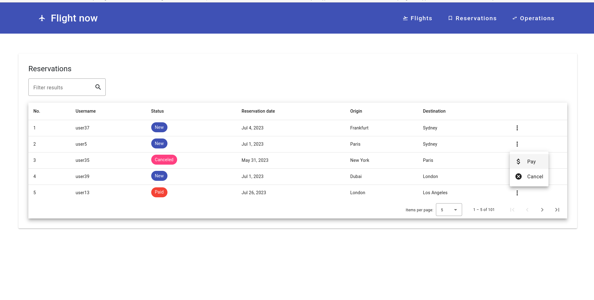

# Flight-app
Projekt realizowany w ramach przedmiotu Bazy Danych 2 na semestrze 4 roku 2022/2023.

# Temat
Zarządzanie połączeniami lotniczymi - dodawanie nowych możliwości, rezerwacja, itp (CRUD)

# Autorzy
Kacper Klimas (`kaklimas@student.agh.edu.pl`) i Krzysztof Solecki `ksolecki@student.agh.edu.pl`

# Technologie
 - [Frontend](client/README.md) - Angular, Material UI
 - [Backend](server/README.md) - Node, Express
 - [Database](db/README.md) - Postgresql

# Przykładowe widoki

## Loty

## Detale lotu

## Operacje

## Rezerwacje
