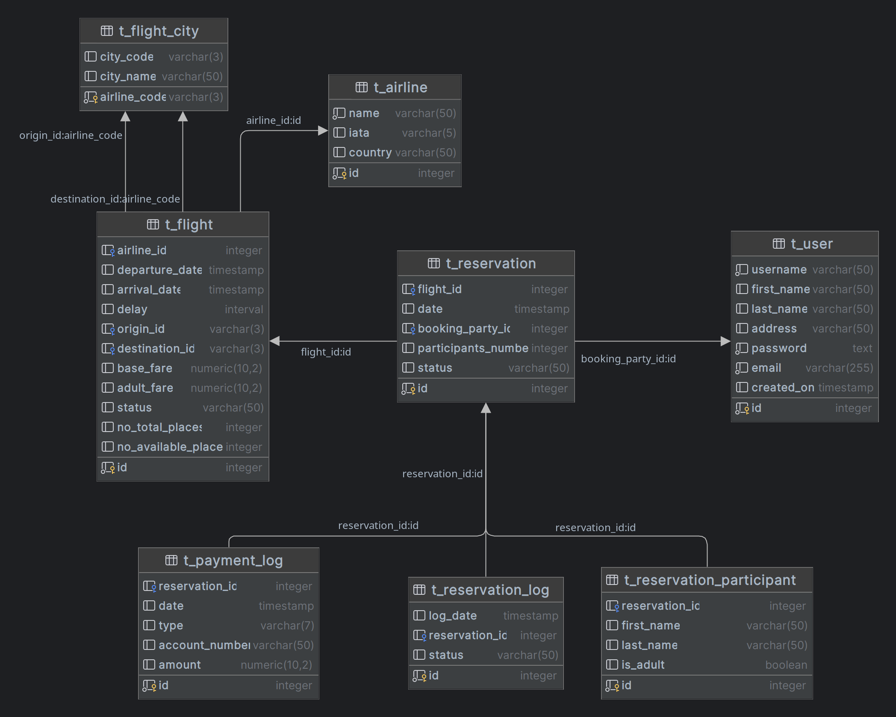

# Baza danych
Projekt został oparty na dockerowym obrazie bazy Postgresql

# Struktura bazy danych


# Uruchamianie
W obecnym katalogu znajduje się plik ``docker-compose.yml``
który zawiera konfigurację uruchomieniową dla serwera bazy danych
oraz skrypt napisany w Pythonie generujący podstawowe dane.

Aby uruchomić plik należy mieć zainstalowane narzędzie docker oraz wpisać
w konsoli ``docker-compose up``.

W przypadku nie posiadania dockera, można skorzystać z własnego serwera bazodanowego.
Aby wyeksportować do niego dane wygenerowane przez skrypt, należy zmodyfikować plik ``migration/src/config.py``
wpisując tam poprawne namiary oraz odpalić plik ``migration/src/main.py`` (może być konieczne wcześniejsze pobranie zależności
`pip install --no-cache-dir -r requirements.txt`
.

Aby wyłącznie stworzyć strukturę bazy oraz wygenerować małą część danych można ręcznie uruchomić
skrypty psql znajdujące się w katalogu `resources`

# Opisy tabel
Poniżej znajdują się opisy tabel wraz z tłumaczeniem bardziej enigmatycznych pól

- `t_flight` - dane na temat lotów
  - status - NEW, DELAYED, CANCELED
  - adult_fare - dodatkowa opłata za dorosłego
```
create table t_flight
(
    id                  int generated by default as identity
        primary key,
    airline_id          int,
    departure_date      timestamp,
    arrival_date        timestamp,
    delay               interval,
    origin_id           varchar(3),
    destination_id      varchar(3),
    base_fare           numeric(10, 2),
    adult_fare          numeric(10, 2),
    status              VARCHAR(50) CHECK (status IN ('ACTIVE', 'DELAYED', 'CANCELED')) DEFAULT 'ACTIVE',
    no_total_places     integer,
    no_available_places integer,
    constraint fk_airline foreign key (airline_id) references t_airline (id),
    constraint fk_origin foreign key (origin_id) references t_flight_city (airline_code),
    constraint fk_destination foreign key (destination_id) references t_flight_city (airline_code)
);
```
- `t_flight_city` - dane na temat miast, w których znajdują się lotniska
  - airline_code - każde miasto ma swój unikalny kod lotniczy 
```
create table t_flight_city
(
    airline_code varchar(3) primary key,
    city_code    varchar(3) unique,
    city_name    varchar(50)
);
```
- `t_airline` - dane na temat linii lotniczych
```
create table t_airline
(
    id      int generated by default as identity
        primary key,
    name    varchar(50) not null
        unique,
    iata    varchar(5),
    country varchar(50)
);
```
- `t_reservaton` - dane na temat rezerwacji lotów
  - booking_party_id - id osoby rezerwującej lot
  - participants_number - ilość osób podlegających pod rezerwacje
  - rezerwację musi złożyć osoba znajdująca się w bazie danych natomiast osoby
    uwzględnione już nie muszą się w niej znajdować
  - status - NEW, PAID, CANCELED
```
create table t_reservation
(
    id                  int generated by default as identity
        primary key,
    flight_id           int,
    date                timestamp                                                 default CURRENT_TIMESTAMP,
    booking_party_id    int,
    participants_number int                                                       default 1,
    status              VARCHAR(50) CHECK (status IN ('NEW', 'PAID', 'CANCELED')) DEFAULT 'NEW',
    constraint fk_flight foreign key (flight_id) references t_flight (id),
    constraint fk_user foreign key (booking_party_id) references t_user (id)
);
```
- `t_user` - dane na temat użytkowników
```
create table t_user
(
    id         int generated by default as identity
        primary key,
    username   varchar(50)  not null
        unique,
    first_name varchar(50),
    last_name  varchar(50),
    address    varchar(50),
    password   text         not null,
    email      varchar(255) not null
        unique,
    created_on timestamp default CURRENT_DATE
);
```
- `t_reservaton_log` - logi rezerwacji, obsługiwane przez trigger
```
create table t_reservation_log
(
    id             int generated by default as identity primary key,
    log_date       timestamp default current_timestamp,
    reservation_id int,
    status         VARCHAR(50) CHECK (status IN ('NEW', 'PAID', 'CANCELED')),
    constraint fk_reservation foreign key (reservation_id) references t_reservation (id)
);
```
- `t_payment_log` - logi płatności oraz zwrotów płatności za rezerwacje
```
create table t_payment_log
(
    id             int generated by default as identity primary key,
    reservation_id int,
    date           timestamp                                        default current_timestamp,
    type           VARCHAR(7) CHECK (type IN ('INCOME', 'OUTCOME')) DEFAULT 'INCOME',
    account_number varchar(50)                                      default substring(md5(random()::text), 1, 10),
    amount         numeric(10, 2),
    constraint fk_reservation foreign key (reservation_id) references t_reservation (id)
);
```
- `t_reservation_participant` - dane na temat osób uwzględnionych podczas składanie rezerwacji
```
create table t_reservation_participant
(
    id             int generated by default as identity primary key,
    reservation_id int,
    first_name     varchar(50),
    last_name      varchar(50),
    is_adult       boolean default true,
    constraint fk_reservation foreign key (reservation_id) references t_reservation (id)
);
```

# Opisy widoków
Widoki są wykorzystywane przez backend w celu pobrania z bazy zmergowanych danych.

- flights
```
create or replace view flights as
select tf.id,
       ta.id        as airline_id,
       ta.name,
       t1.city_name as origin_city,
       t2.city_name as destination_city,
       tf.status,
       tf.departure_date,
       tf.arrival_date,
       tf.delay,
       tf.no_available_places,
       tf.base_fare,
       tf.adult_fare
from t_flight tf
         inner join t_airline ta on tf.airline_id = ta.id
         inner join t_flight_city t1 on tf.origin_id = t1.airline_code
         inner join t_flight_city t2 on tf.destination_id = t2.airline_code;
```
- available_flights - wykaz dostępnych lotów (są miejsca oraz lot nie jest odwołany)
```
create or replace view available_flights as
select tf.id,
       ta.id        as airline_id,
       ta.name,
       t1.city_name as origin_city,
       t2.city_name as destination_city,
       tf.status,
       tf.departure_date,
       tf.arrival_date,
       tf.delay,
       tf.no_available_places,
       tf.base_fare,
       tf.adult_fare
from t_flight tf
         inner join t_airline ta on tf.airline_id = ta.id
         inner join t_flight_city t1 on tf.origin_id = t1.airline_code
         inner join t_flight_city t2 on tf.destination_id = t2.airline_code
where tf.no_available_places > 0
  and tf.departure_date > current_date
  and tf.status <> 'CANCELED';
```
- payment_transactions - logi płatności
```
create or replace view payment_transactions as
select t.id, t.reservation_id, t.type, t.amount, t.date, tu.username, t.account_number
from t_payment_log t
         inner join t_reservation tr on tr.id = t.reservation_id
         inner join t_user tu on tu.id = tr.booking_party_id;
```
- reservations - dane na temat rezerwacji
```
create or replace view reservations as
select tr.id,
       tf.id          as flight_id,
       tr.date        as reservation_date,
       tr.status,
       tu.username    as booking_party_username,
       tr.participants_number,
       tf.departure_date,
       tf.arrival_date,
       tf.delay,
       tfc1.city_name as origin_city,
       tfc2.city_name as destination_city
from t_reservation tr
         inner join t_user tu on tu.id = tr.booking_party_id
         inner join t_flight tf on tf.id = tr.flight_id
         inner join t_flight_city tfc1 on tfc1.airline_code = tf.origin_id
         inner join t_flight_city tfc2 on tfc2.airline_code = tf.destination_id
```
- reservation_transactions - logi rezerwacji
```
create or replace view reservation_transactions as
select tr.id, tu.first_name, tu.last_name, tr.status, tr.log_date
from t_reservation_log tr
         inner join t_reservation t on t.id = tr.reservation_id
         inner join t_user tu on tu.id = t.booking_party_id
```

# Opisy funkcji, procedur oraz triggerów
Funkcje oraz procedury zostały stworzone aby przenieść całą logikę na stronę serwera bazodanowego - walidacja danych,
dodawanie rezerwacji, odwoływanie lotów, itp.

Poniżej zostaną wylistowane ciekawsze z nich (bez uwzględniania `sth_exists(id)`)

- `p_delay_flight(flightId: int, delat: interval)` - procedura wykorzystywana do opóźniania lotów
```
CREATE OR REPLACE PROCEDURE p_delay_flight(flight_id INT, delay INTERVAL)
AS
$$
DECLARE
    flight_status varchar(50);
BEGIN
    CALL p_flight_exists(flight_id);
    select status into flight_status from t_flight tf where tf.id = flight_id;
    if flight_status = 'CANCELED' then
        raise exception 'Cannot delay canceled flight.';
    end if;
    UPDATE t_flight
    SET delay  = p_delay_flight.delay,
        status = 'DELAYED'
    WHERE id = flight_id;
END;
$$ LANGUAGE plpgsql;
```
- `f_get_flight_by_id` - funkcja wykorzystywana do wyciągania lotu po jego id
```
CREATE OR REPLACE FUNCTION f_get_flight_by_id(flight_id INT)
    RETURNS TABLE
            (
                id                  int,
                departure_date      timestamp,
                arrival_date        timestamp,
                origin_city         varchar(50),
                destination_city    varchar(50),
                delay               interval,
                status              varchar(30),
                base_fare           numeric(10, 2),
                adult_fare          numeric(10, 2),
                no_available_places int,
                no_total_places     int
            )
AS
$$
BEGIN
    return query
        select tf.id,
               tf.departure_date,
               tf.arrival_date,
               tfc1.city_name as origin,
               tfc2.city_name as destination,
               tf.delay,
               tf.status,
               tf.base_fare,
               tf.adult_fare,
               tf.no_available_places,
               tf.no_total_places
        from t_flight tf
                 inner join t_airline ta on ta.id = tf.airline_id
                 inner join t_flight_city tfc1 on tfc1.airline_code = tf.origin_id
                 inner join t_flight_city tfc2 on tfc2.airline_code = tf.destination_id
        where tf.id = flight_id;
END;
$$
    LANGUAGE plpgsql;
```
- `p_reservation_can_be_paid` - procedura sprawdzająca czy podana rezerwacja może zostać opłacona
```
CREATE OR REPLACE PROCEDURE p_reservation_can_be_paid(p_id INT)
AS
$$
BEGIN
    IF NOT EXISTS(SELECT 1 FROM t_reservation WHERE id = p_id and status = 'NEW') THEN
        RAISE EXCEPTION 'Reservation with ID % cannot be paid off.', p_id;
    END IF;
END;
$$ LANGUAGE plpgsql;
```
- `p_add_reservation` - procedura dodająca rezerwację
```
CREATE OR REPLACE PROCEDURE p_add_reservation(
    r_flight_id INT,
    r_booking_party_id INT,
    r_participants JSONB
)
AS
$$
DECLARE
    r_reservation_id          INT;
    r_participant_id          INT;
    r_flight_available_places INT;
    r_flight_status           VARCHAR;
    r_participant             RECORD;
BEGIN
    CALL p_flight_exists(r_flight_id);
    CALL p_user_exists(r_booking_party_id);
    select t.no_available_places, t.status into r_flight_available_places, r_flight_status from t_flight t where t.id = r_flight_id limit 1;
    IF r_flight_available_places < jsonb_array_length(r_participants) then
        raise exception 'Not enough places to book for all people.';
    end if;
    IF r_flight_status = 'CANCELED' then
        raise exception 'Cannot book canceled flight.';
    end if;
    INSERT INTO t_reservation (flight_id, booking_party_id, participants_number)
    VALUES (r_flight_id, r_booking_party_id, jsonb_array_length(r_participants))
    RETURNING id INTO r_reservation_id;
    FOR r_participant IN SELECT *
                         FROM jsonb_to_recordset(r_participants) as r(first_name varchar(50), last_name varchar(50), is_adult boolean)
        LOOP
            INSERT INTO t_reservation_participant (reservation_id, first_name, last_name, is_adult)
            VALUES (r_reservation_id, r_participant.first_name, r_participant.last_name, r_participant.is_adult)
            RETURNING r_participant_id INTO r_participant_id;
        END LOOP;
    COMMIT;
END;
$$ LANGUAGE plpgsql;
```
- `p_add_reservation_log` - procedura wołana w momencie wywołania triggera `tr_add_reservation_log`
```
CREATE OR REPLACE FUNCTION f_add_reservation_log()
    RETURNS TRIGGER AS
$$
BEGIN
    IF NEW.status = 'NEW' THEN
        UPDATE t_flight t
        SET no_available_places = t.no_available_places - NEW.participants_number
        WHERE t.id = NEW.flight_id;
    END IF;
    IF NEW.status = 'CANCELED' THEN
        UPDATE t_flight t
        SET no_available_places = t.no_available_places + NEW.participants_number
        WHERE t.id = NEW.flight_id;
    END IF;
    INSERT INTO t_reservation_log (reservation_id, status)
    VALUES (NEW.id, NEW.status);
    RETURN NEW;
END
$$
    LANGUAGE plpgsql;
```
```
CREATE OR REPLACE TRIGGER tr_add_reservation_log
    AFTER INSERT OR UPDATE
    ON t_reservation
    FOR EACH ROW
EXECUTE FUNCTION f_add_reservation_log();

CREATE OR REPLACE FUNCTION f_forbid_deletion()
    RETURNS TRIGGER AS
$$
BEGIN
    RAISE EXCEPTION 'Cannot delete rows from this table.';
END
$$
    LANGUAGE plpgsql;
```
- `f_forbid_deletion` - funckja blokująca usunięcie rekordu, wykorzystywana przez dwa triggery
```
CREATE OR REPLACE FUNCTION f_forbid_deletion()
    RETURNS TRIGGER AS
$$
BEGIN
    RAISE EXCEPTION 'Cannot delete rows from this table.';
END
$$
    LANGUAGE plpgsql;
```
```
CREATE OR REPLACE TRIGGER tr_forbid_reservation_deletion
    BEFORE DELETE
    ON t_reservation_log
    FOR EACH ROW
EXECUTE FUNCTION f_forbid_deletion();

CREATE OR REPLACE TRIGGER tr_forbid_log_deletion
    BEFORE DELETE
    ON t_reservation_log
    FOR EACH ROW
EXECUTE FUNCTION f_forbid_deletion();
```
- `f_get_reservation_cost` - funkcja zwracająca wartość rezerwacji w zależności od ilości osób (pełnoletnich oraz niepełnoletnich) oraz ceny lotu
```
CREATE OR REPLACE FUNCTION f_get_reservation_cost(reservation_id INT)
    RETURNS NUMERIC(10, 2)
AS
$$
DECLARE
    flight_base_fare  NUMERIC(10, 2);
    flight_adult_fare NUMERIC(10, 2);
    total_amount      NUMERIC(10, 2) := 0;
    participant       record;
BEGIN
    SELECT base_fare, adult_fare
    INTO flight_base_fare, flight_adult_fare
    FROM t_flight
    WHERE reservation_id = f_get_reservation_cost.reservation_id
    LIMIT 1;
    FOR participant IN
        SELECT is_adult
        FROM t_reservation_participant t
        WHERE t.reservation_id = f_get_reservation_cost.reservation_id
        LOOP
            IF participant.is_adult THEN
                total_amount := total_amount + flight_base_fare + flight_adult_fare;
            ELSE
                total_amount := total_amount + flight_base_fare;
            END IF;
        END LOOP;
    RETURN total_amount;
END;
$$
    LANGUAGE plpgsql;
```
- `f_get_reservation_by_id` - funkcja zwracająca dodatkowe dane na temat rezerwacji
```
CREATE OR REPLACE FUNCTION f_get_reservation_by_id(f_reservation_id INT)
    RETURNS TABLE
            (
                id               INT,
                reservation_date TIMESTAMP,
                status           VARCHAR(50),
                departure_date   TIMESTAMP,
                arrival_date     TIMESTAMP,
                origin_city      VARCHAR(50),
                destination_city VARCHAR(50),
                delay            INTERVAL,
                base_fare        NUMERIC(10, 2),
                adult_fare       NUMERIC(10, 2),
                participants     JSON[]
            )
AS
$$
BEGIN
    RETURN QUERY
        SELECT tr.id,
               tr.date,
               tr.status,
               tf.departure_date,
               tf.arrival_date,
               tfc1.city_name AS origin_city,
               tfc2.city_name AS destination_city,
               tf.delay,
               tf.base_fare,
               tf.adult_fare,
               ARRAY(
                       SELECT JSON_BUILD_OBJECT('first_name', rp.first_name, 'last_name', rp.last_name, 'is_adult',
                                                rp.is_adult)
                       FROM t_reservation_participant rp
                       WHERE rp.reservation_id = f_reservation_id
                   )          AS participants
        FROM t_reservation tr
                 INNER JOIN t_flight tf ON tr.flight_id = tf.id
                 INNER JOIN t_flight_city tfc1 ON tfc1.airline_code = tf.origin_id
                 INNER JOIN t_flight_city tfc2 ON tfc2.airline_code = tf.destination_id
        WHERE tr.id = f_reservation_id
        LIMIT 1;
END;
$$
    LANGUAGE plpgsql;
```
- `p_make_payment` - procedura służąca do opłacania rezerwacji
```
CREATE OR REPLACE PROCEDURE p_make_payment(p_reservation_id INT)
AS
$$
BEGIN
    CALL p_reservation_can_be_paid(p_reservation_id);
    UPDATE t_reservation
    SET status = 'PAID'
    WHERE id = p_make_payment.p_reservation_id;
    INSERT INTO t_payment_log (reservation_id, amount)
    VALUES (p_reservation_id, (select f_get_reservation_cost(p_reservation_id)));
END;
$$ LANGUAGE plpgsql;
```
- `p_cancel_reservation` - odwoływanie rezerwacji, dzięki triggerowi zwalniane są miejsca dla danego lotu oraz wypłacany jest zwrot opłat
```
CREATE OR REPLACE PROCEDURE p_cancel_reservation(reservation_id integer)
AS
$$
DECLARE
    reservation record;
    payment     record;
BEGIN
    CALL p_reservation_exists(p_cancel_reservation.reservation_id);
    SELECT * into reservation from t_reservation t where t.id = p_cancel_reservation.reservation_id LIMIT 1;
    IF reservation.status = 'CANCELED' THEN
        raise exception 'Cannot cancel already canceled reservation.';
    end if;
    IF reservation.status = 'PAID' THEN
        select * into payment from t_payment_log t where t.reservation_id = p_cancel_reservation.reservation_id;
        INSERT INTO t_payment_log (reservation_id, amount, type, account_number)
        VALUES (p_cancel_reservation.reservation_id,
                (select f_get_reservation_cost(p_cancel_reservation.reservation_id)), 'OUTCOME',
                payment.account_number);
    END IF;
    UPDATE t_reservation
    SET status = 'CANCELED'
    WHERE id = p_cancel_reservation.reservation_id;
END;
$$ LANGUAGE plpgsql;
```
- `p_cancel_flight` - odwołanie lotu, wywołuje to odwołanie wszystkich rezerwacji na dany lot, a co za tym idzie zwrot opłat dla
  wsystkich rezerwujących
```
CREATE OR REPLACE PROCEDURE p_cancel_flight(flight_id INT)
AS
$$
DECLARE
    reservation_id     INT;
    reservation_status varchar(50);
BEGIN
    CALL p_flight_exists(p_cancel_flight.flight_id);
    FOR reservation_id, reservation_status IN
        SELECT id, status
        FROM t_reservation t
        WHERE t.flight_id = p_cancel_flight.flight_id
        LOOP
            IF reservation_status <> 'CANCELED' THEN
                CALL p_cancel_reservation(reservation_id);
            end if;
        END LOOP;
    update t_flight tf set status = 'CANCELED' where tf.id = flight_id;
END;
$$ LANGUAGE plpgsql;
```
- `f_user_transactions` - funkcja zwracająca historię rezerwacji danego użytkownika
```
CREATE OR REPLACE FUNCTION f_user_transactions(f_user_id INT)
    RETURNS TABLE
            (
                id         int,
                username   varchar(50),
                first_name varchar(50),
                last_name  varchar(50),
                logs       json[]
            )
AS
$$
BEGIN
    return query
        select t.id,
               t.username,
               t.first_name,
               t.last_name,
               array(select json_build_object('log_date', log_date, 'reservation_id', reservation_id, 'status', status)
                     from t_reservation_log trl
                     where trl.reservation_id = tr.id)
        from t_user t
                 inner join t_reservation tr on t.id = tr.booking_party_id
        where t.id = f_user_id
        limit 1;
END;
$$
    LANGUAGE plpgsql;
```
- `add_flight` - dodawanie lotu
```
CREATE OR REPLACE PROCEDURE p_add_flight(
    p_airline_id INT,
    p_departure_date TIMESTAMP,
    p_arrival_date TIMESTAMP,
    p_delay INTERVAL,
    p_origin_id VARCHAR(3),
    p_destination_id VARCHAR(3),
    p_base_fare NUMERIC(10, 2),
    p_adult_fare NUMERIC(10, 2),
    p_no_total_places INT
)
AS
$$
BEGIN
    CALL p_airline_exists(p_airline_id);
    CALL p_validate_dates(p_departure_date, p_arrival_date);
    CALL p_flight_city_exists(p_origin_id);
    CALL p_flight_city_exists(p_destination_id);
    CALL p_validate_numeric(p_base_fare);
    CALL p_validate_numeric(p_adult_fare);
    CALL p_validate_numeric(p_no_total_places);
    insert into t_flight (airline_id, departure_date, arrival_date, delay, origin_id, destination_id, base_fare,
                          adult_fare, no_total_places, no_available_places)
    values (p_airline_id, p_departure_date, p_arrival_date, p_delay, p_origin_id, p_destination_id, p_base_fare,
            p_adult_fare, p_no_total_places, p_no_total_places);
END;
$$ LANGUAGE plpgsql;
```
- `f_flight_participants` - funkcja zwracająca wszystkich użytkowników danego lotu
```
CREATE OR REPLACE FUNCTION f_flight_participants(f_flight_id INT)
    RETURNS TABLE
            (
                reservation_id int,
                first_name     varchar(50),
                last_name      varchar(50),
                is_adult       boolean
            )
AS
$$
BEGIN
    call p_flight_exists(f_flight_id);
    return query
        select tr.id as reservation_id,
               trp.first_name,
               trp.last_name,
               trp.is_adult
        from t_flight t
                 inner join t_reservation tr on t.id = tr.flight_id
                 inner join t_reservation_participant trp on tr.id = trp.reservation_id
        where t.id = f_flight_id
          and tr.status <> 'CANCELED';
END;
$$
    LANGUAGE plpgsql;

create or replace view reservation_transactions as
select tr.id, tu.first_name, tu.last_name, tr.status, tr.log_date
from t_reservation_log tr
         inner join t_reservation t on t.id = tr.reservation_id
         inner join t_user tu on tu.id = t.booking_party_id
```